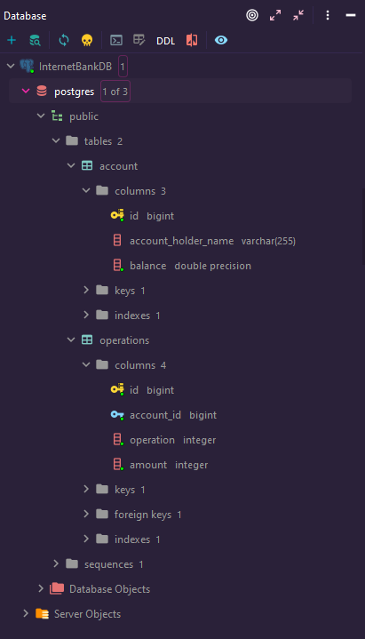

# Internet Banking API Java Project

---

#### This is the **final project** that has a purpose of being kind of like a dissertation to complete my Java Developer Course.
This is a great project that will go into my cool portfolio _:)_

What makes this project stand out is that it will help develop the proficiency in creating a REST API project.
It utilizes RESTful operation in the form of methods that process data from a structured SQL database.
Those methods will work with SQL database, then the collected data will be processed and outputted in the form of JSON.

The project code is written in the Java 17. For the dependencies management and tool for building the project,
I choose to use Gradle because I use Maven quite a lot and I want to learn how to use gradle again.
I have also added a few dependencies that I think will be useful, which includes:
* Lombok - To reduce boiler code.
* Spring Web - Includes Spring MVC that helps to develop RESTful API.
* JUnit - Framework to write and write tests.
* Testcontainers - Lightweight API for bootstrapping integration tests with real services wrapped in Docker containers.

---

### **TASK**: Realize a REST API for an Internet Bank that is used to deal with financial operations, aka BaaS.

List of the functionality that will be realized:
- Find out the person's balance.
- Withdraw of X amount from the account.
- Balance top-up.
- History of user's financial operations in a period of time.
- Transfer X amount to another person.
  The answers will be in the form of a JSON.

"Internet Bank API" thus will have these functions:
* getBalance(_ID_)
* takeMoney(_ID_, _AMOUNT_)
* putMoney(_ID_, _AMOUNT_)
* getOperationList(_ID_, _START_DATE_, _END_DATE_)
* transferMoney(_ID_, _RECEIVER_ID_, _AMOUNT_)

---

### Structure of the PostgreSQL Database
